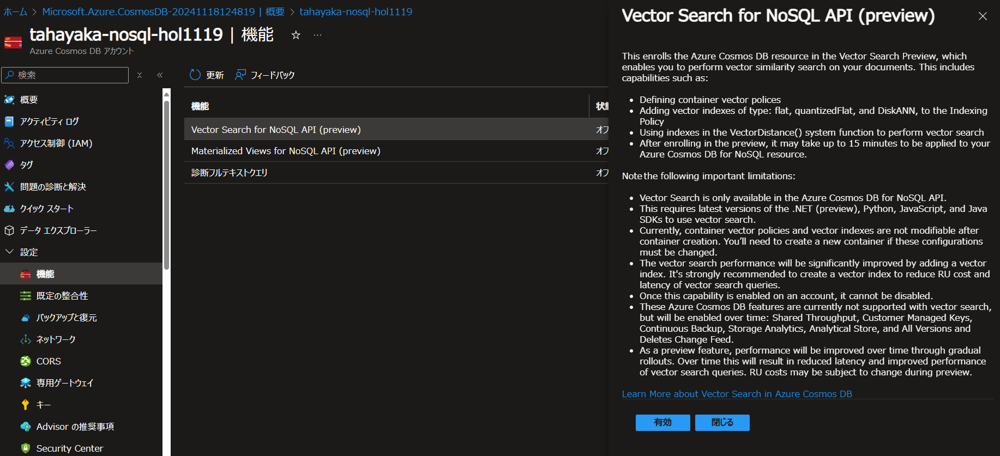

座学テキストは[コチラ](./VectorEssestials.pdf)

# CosmosDBでのベクトル検索 実践編 <BR> (Azure Cosmos DB for NoSQL)

  ## Cosmos DB for NoSQLについての概略
  - Azureにおける分散型NoSQLデータストア
  - JSONを利用したスキーマレス(項目の事前定義必要なし)なドキュメントを分散システムで高速に取り扱う
  - アプリのログ、生成AIとのやり取りのログなどの格納に便利
  - OpenAI ChatGPTやMicrosoft Teamsのバックエンドとして活躍
  - 全世界のデータセンター全てに存在し、マルチマスター書き込みなどにも対応
  - SLA99.999%、99%のデータ読み込みを<10msと定義する堅牢かつ高速なデータストア

  ## Cosmos DB for NoSQLのベクトルデータの取り扱い

- ベクトルデータ関連機能
  - ベクトルインデックス
    - ベクトルインデックスがある場合、ベクトルデータの検索が高速になる。
    - ベクトルインデックスがなければ全検索(ブルートフォース)で検索する。
  - ベクトルインデックスの種類  
    - Flat
      - そのまま格納する。その場合ベクトルインデックスのサイズが大きいため、*505次元までしか格納できない*ので注意。
    - Quantized Flat(量子化Flat)
      - 量子化(圧縮)して格納する。量子化されたベクトルはサイズが小さくなるため、4096次元まで格納できるようになる。
    - DiskANN
      - 量子化と最適なRAM/SSD配置方式をあわせた、Microsoft独自の近似近傍検索(ANN)技法が使えるインデックス。4096次元まで対応。
      - Public Preview中で、CosmosDBの「機能」メニューからONにすることで利用が可能となる。

  - ベクトルインデックスの作成
    - インデックスポリシー
      インデックス生成に関するポリシー。ベクトル検索機能搭載以前でも存在したが、ベクトル項目の定義が追加された
      - "path": ベクトル項目
      - "type": "flat","quantizedFlat","diskANN"より選択
      ```JSON
      {
        "indexingMode": "consistent",
        "automatic": True,
        "includedPaths": [
            {
                "path": "/*"
            }
        ],
        "excludedPaths": [
            {
                "path": "/\"_etag\"/?"
            }
        ],
        "vectorIndexes": [
            {
                "path": "/vectors",
                "type": "quantizedFlat"
            }
        ]
    }
      ```
    - ベクトル埋め込みポリシー
      ベクトル埋め込みの方法に関するポリシー。ベクトル検索の搭載に合わせて新規追加されたポリシー項目。
      - "path": ベクトルを含むプロパティ パス
      - "datatype": ベクトルの要素の型 (既定値 Float32)
      - "distanceFunction": 距離/類似度の計算に使用するメトリック (既定値 Cosine)
      - "dimensions": パス内の各ベクトルの長さ (既定値 1536)
      ```JSON
      {
        "vectorEmbeddings": [
            {
                "path":"/vectors",
                "dataType":"float32",
                "distanceFunction":"cosine",
                "dimensions":1536
            }
        ]
      }
      ```

  - ベクトル検索クエリの発行
    - SQLライククエリで実現
      - 検索対象のベクトル配列と、データの中でベクトルインデックスがはられている項目名を指定する
      - TOP Nで上位いくつまでを指定
      ```SQL
      SELECT TOP 2 c.id, c.name, c.num, 
      VectorDistance(c.vectors, @vector) AS similarity,
      c.text
      FROM c
      ORDER BY VectorDistance(c.vectors, @vector)
      ```

    `VectorDistance(比較先ベクトル項目(N件),比較元ベクトル(1件))`

- Cosmos DB for NoSQLでベクトル検索を使うための準備
  - Cosmos DB for NoSQL アカウントの作成(すでに作成されている場合はスキップ)
    
  - Cosmos DB for NoSQL アカウントのメニューより「機能」を選択肢、"Vector Search for Cosmos DB for NoSQL"をオンにする
    


- CosmosDB for NoSQLでのベクトルデータの管理
  1. コンテナーに対してベクトルインデックスを設定する
    - *ベクトル関連設定はコンテナー作成時のみ*なので注意
  3. テキストデータを準備する
  4. テキスト部分をEmbedding APIを適用してベクトルに変換する
  5. 変換したデータをベクトルとしてMongoDB vCoreに登録する

- ベクトル検索の実施
  1. 検索対象となるテキストを得る
  1. テキストをEmbedding APIを適用してベクトルに変換する
  1. 変換したベクトルとパラメータを設定して検索する

### ベクトルデータの格納

- 環境準備
  - Azure OpenAI Serviceの準備
    - `text-embedding-ada-002`をデプロイしておく(可能であればデプロイ名は"text-embedding-ada-002"に)
    
    
    - Azure OpenAI Serviceの"キーとエンドポイント"から`キー1`と`エンドポイント`の値を控えておく
    
    
  - Pythonライブラリの導入
    - `azure-cosmos`,`openai`,`langchain`を必要に応じて`pip install`を用いてインストールする
    - IDE(VSCode,Spyder,Jupyter)を利用する場合は`nest_asyncio`をインストールする
  - テストデータのダウンロードと解凍
    - 任意の場所にて以下を実行する
      ```sh
      wget https://github.com/tahayaka-microsoft/CosmosDB_Vectors_NoSQL/raw/main/assets/test1000.tar
      tar -xvf test1000.tar
      ```
      `test1000`ディレクトリのパスを記録する(サンプルアプリの書き換えに利用する) `pwd`等を用いる

- サンプルアプリ(01_vectorize.py)
  - 以下の環境変数を設定する。
    - OPENAI_URI
    - OPENAI_KEY
    - COSMOSDB_URI
    - COSMOSDB_KEY

  - main()ループのglob.globのディレクトリ名称(85行目の`'/home/xxxx/test1000/*.txt'`)を`test1000`ディレクトリのパスに変更する。
  - `python 01_vectorize.py`で実行する


### ベクトル検索の実行

- サンプルアプリ(02_search.py)
  - `python 02_search.py`で実行する
  - 検索したいテキストを入力する


